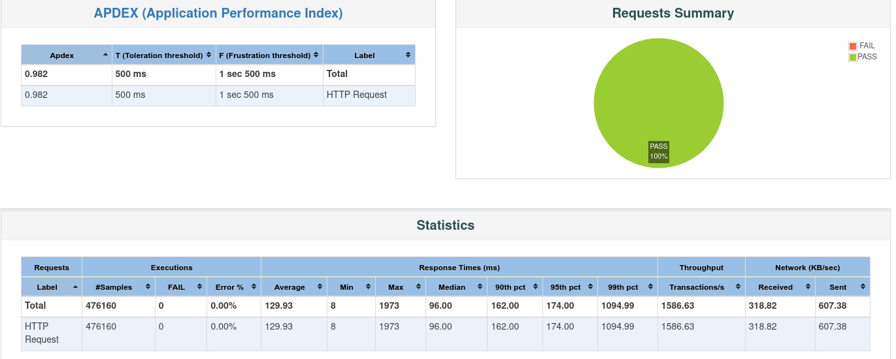

# Batch Processing for Performance Optimization

## Overview

The implementation of **batch processing** significantly increases performance and throughput for heavy write operations. In high-request-rate scenarios, committing to the database for every individual request creates bottlenecks due to:

- Validation overhead
- Database connection management
- Write operations and commits
- Overall request processing time

For thousands of requests, this traditional approach drastically decreases throughput.

**Solution:** In-memory batch processing increases throughput by approximately **20-25%**.

> **Note:** This implementation is still in development and may be fragile.

---

## Request Flow
```
User Request → POST /tasks/ → Batch Processor Thread → User Response → Background Thread Commit → Database
```

### Flow Breakdown:

1. **User initiates POST request** → Request is added to the batch processing bucket
2. **User receives immediate response** → "Task added successfully" (no waiting for DB commit)
3. **Background processing** → Batch is committed when conditions are met
4. **Database commit** → Reduced number of expensive single commits

---

## How It Works

### Core Components

- **Threading Module**: Manages background workers that process and batch commit requests to the database
- **Batch Size**: Minimum threshold for batch processing
- **Last Commit Timestamp**: Tracks timing of the most recent commit

### Commit Triggers

The batch is committed to the database when **either** condition is met:

#### 1. **Size-Based Trigger**
- Batch size reaches or exceeds the configured threshold
- Optimizes for high-traffic scenarios

#### 2. **Time-Based Trigger**
- Prevents requests from sitting in the batch indefinitely
- Commits after a specified time interval, regardless of batch size
- Ensures system stability and data integrity
- Addresses the edge case where request rate drops significantly

---

## Why Time-Based Commits Matter

Without time-based commits, requests could remain unprocessed during low-traffic periods, causing:
- User confusion (no visible confirmation)
- Data integrity issues
- System instability

The dual-trigger approach maintains both **performance** (batch efficiency) and **reliability** (timely processing).

---
**Testing done using good `Apache's JMETER`**

**Test JMETER specs:**
- Threads :450 
- Ramp-up time: 60second (means in 60 second first 450 threads would be created)
- looop : infinite 
- duration:300seconds

> Little bit of JMETER knowledge  is required 

#### 
- Througput (or TPS) -> 1585/sec
- Increasing the thread count in the jmeter start increasing satuaration and TPS start dropping

#### 
- Througput (or TPS) -> 1790/sec
- There is good amount of througput jump you will see 


**Future**  : Making Central Saparate concurrent batch worker  so that in crash , or web server (gunicorn)
if any worker have got stopp working or some problem  which made the request unattented and it will have persistent storage and log file to replay after crash 

---


